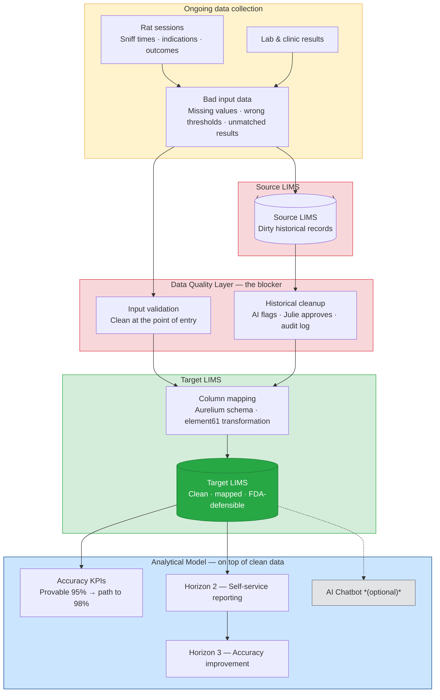
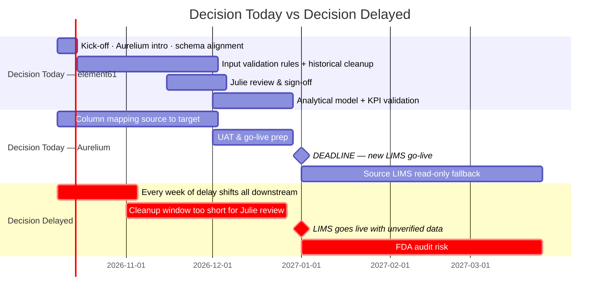

# POC Presentation Plan — APOPO × element61
**Audience:** Pieter (Head of Training & Research) + likely CEO
**Format:** Board-ready, 6 slides + optional demo appendix. Situation → Complication → Options → Ask
**Constraint:** Must stand alone — Pieter presents to the board without element61 in the room
**Action item:** Book follow-up meeting with Julie before presentation

---

## The One-Sentence Pitch

> APOPO has a fixed LIMS migration deadline of 1 January 2027 and an FDA accuracy target of 98%. The migration will happen — but unless data quality is addressed now, dirty data moves into the new system and the FDA gap stays open. The window to fix it is this project.

---

## Assumptions

These assumptions underpin the entire presentation. If any of them are wrong, the recommendation changes. Validate with Pieter before presenting.

| # | Assumption | Risk if wrong |
|---|-----------|---------------|
| 1 | **1 January 2027 is a hard deadline.** The new LIMS go-live date is fixed and cannot be pushed. | If the deadline is flexible, the urgency argument weakens and there is more room to choose a slower approach. |
| 2 | **FDA requires 98% accuracy for approval.** This is the regulatory threshold APOPO is targeting. | If the requirement is different, the gap (and therefore the pitch) changes. |
| 3 | **APOPO currently achieves ~95% accuracy.** This is the claimed figure — not yet verifiable from the data as it stands today. | If the true figure is lower (or higher), the framing of the gap and the opportunity shifts. |
| 4 | **The source LIMS is operational until 1 January; the target LIMS already exists but is empty, with different column mappings.** The migration is a column mapping exercise, not a system replacement. | If the target LIMS schema is still changing, the column mapping work has to be redone. Confirm with Aurelium before starting. |
| 5 | **Aurelium (the IT company managing both LIMS) has a response time of approximately one week.** Any schema clarification, access request, or environment question goes through them. | Aurelium delays cascade directly into the project timeline. Their involvement must be coordinated from day one, not reactively. |
| 6 | **Full read access to the source LIMS can be arranged through Aurelium in week 1.** Element61 needs the data to begin column mapping and data quality analysis. | Every week of delayed access is a week less for cleaning and review. At 4 weeks of delay, the timeline breaks. |
| 7 | **Data quality problems exist at two levels: bad input data (ongoing) and dirty historical records (existing).** Both must be addressed — one at the point of entry, one during migration — for FDA accuracy to be achievable. | If only one layer is cleaned, the other will continue to undermine accuracy. The model will be built on a partially clean foundation. |
| 8 | **Julie is available during the review phase (weeks 3–8) and has authority to approve data quality decisions.** Her sign-off is what makes the audit log FDA-defensible. | If Julie is unavailable or her approvals are not considered authoritative, the audit trail loses its value. |
| 9 | **APOPO's IT/compliance team can confirm approved tooling before kick-off.** The data quality and migration environment must meet APOPO's data residency and security requirements. | If approval takes weeks, the environment cannot be built in time. |
| 10 | **Cost estimates ("X days") will be confirmed after source system access.** All CAPEX figures are indicative until element61 can assess data volume and complexity firsthand. | Presenting specific numbers before seeing the data creates expectation risk. Keep ranges until scoping is complete. |
| 11 | **The source LIMS can remain accessible in read-only mode for a period after go-live.** This is the safety fallback if records need to be re-checked post-migration. | If the source LIMS is decommissioned immediately on 1 January, the fallback disappears and any post-go-live data question cannot be traced back to origin. |

---

## Solution Blueprint

---

## Slide Structure

### Slide 1 — Situation
**"APOPO saves lives — but is 3% short of FDA approval and the clock is running."**
- Rats screen TB samples every working day. 95% accuracy today. FDA requires 98%.
- APOPO is already migrating to a new LIMS system. The deadline is fixed: 1 January 2027. The new system already exists — it just needs to be populated.
- The migration is a known, planned event. What is not yet decided is what arrives in the new system: dirty data or clean data.
- The board has a concrete decision to make today. Not next month. Today.

---

### Slide 2 — Complication
**"The migration is happening. The question is what arrives in the new system."**

The LIMS migration itself is managed by Aurelium — it is a column mapping exercise, source schema to target schema. That part will happen regardless. The problem is the data being migrated.

Data quality is the blocker for FDA approval, and it operates at two levels:

**Level 1 — Bad input data (ongoing)**
New data is entering the system today with quality problems at the source:
- Missing lab confirmations on clinic-positive samples
- Zero or missing indication thresholds
- Conflicting rat indications vs. rewarded outcomes

If these problems are not fixed at the point of entry, they will keep arriving in the new LIMS after go-live. The migration resets nothing.

**Level 2 — Dirty historical records (existing)**
The current LIMS contains years of records with accumulated data quality issues. If these migrate as-is, the historical dataset that APOPO would use to prove its 95% accuracy to the FDA will be unverifiable.

**Headline: APOPO can execute a perfect column mapping and still fail the FDA requirement — because the data quality problem lives above the migration layer.**

*This is not a hypothetical risk. This is what element61 found in the first pass of the data.*

---

### Slide 3 — Options & Why Brownfield
**"Three strategies for handling data quality during the migration. We considered all of them."**

The column mapping itself (source schema → target schema) is Aurelium's job. The choice here is about how to handle data quality during that migration — and each approach has a real trade-off:

| Strategy | What it means | Pro | Con | FDA audit-proof | Weeks to Jan 1 |
|----------|--------------|-----|-----|-----------------|----------------|
| **Lift & shift** | Migrate data as-is, address quality after go-live | Fastest. Least disruption to Aurelium's timeline. | Dirty data arrives in the new system. Post-go-live cleanup is harder, slower, and not audit-defensible. | No | 4–6 w ✓ |
| **Greenfield** | Rebuild the dataset from scratch using source documents | Maximum control. Cleanest possible result. | Far too slow for the January deadline. Requires re-entry of years of records. | Yes | 16–20 w ✗ |
| **Brownfield** | Clean and validate data in-flight, during the migration window | Hits the deadline *and* produces a clean, auditable dataset. AI handles bulk; Julie approves edge cases. | Requires Julie's time. Requires Aurelium access from week one. | **Yes** | 10–12 w ✓ |

**Why Brownfield:**
- **Lift & shift** solves the migration but not the problem. The dirty data moves with you — it just becomes someone else's problem to fix in the new system, post-go-live, without an audit trail. The FDA still cannot be given a defensible dataset.
- **Greenfield** is the right answer with unlimited time. APOPO has 12 weeks, not 20.
- **Brownfield** treats the migration window as the opportunity to clean: the AI processes records in bulk, flags what it cannot resolve, and Julie reviews the edge cases. Every decision is logged with field, approver, and timestamp. The result is a clean, traceable dataset that goes into the new LIMS on day one.

**What the AI specifically does:**
- Validates incoming data against defined quality rules (flags missing values, threshold anomalies, conflicting outcomes)
- Maps historical records from source to target schema, flagging records it cannot confidently handle
- Generates a review queue for Julie — she approves, rejects, or overrides
- Writes every decision to an immutable audit log
- Archives original source exports unchanged — always retrievable, independent of LIMS

---

### Slide 4 — What We Need From APOPO
**"This only works if APOPO commits four things from day one."**

Element61 adds the data quality and analytical layer on top of the migration. Aurelium handles the column mapping. For these two workstreams to run in parallel without blocking each other, APOPO must coordinate both:

| Commitment | Why it's critical | When needed |
|-----------|-------------------|-------------|
| **Aurelium introduction and read access to the source LIMS** | Element61 needs schema documentation and data access to begin quality analysis and transformation. Aurelium's ~1-week response time means this request cannot wait — every week of delay is a week less for cleaning and review. | Week 1 (kick-off week) |
| **Alignment with Aurelium on the target schema** | The column mapping is Aurelium's domain. Element61 needs to understand the target structure to design the data quality and transformation rules correctly. A schema that changes mid-project means rework. | Week 1 |
| **Julie's dedicated time for data quality review** | Julie is the domain expert. She is the only person who can validate ambiguous cases — conflicting outcomes, missing values, edge cases the AI flags. The audit log is only FDA-defensible if her approvals are real and documented. | Weeks 3–8 (review phase) |
| **Confirmation of approved tooling** (cloud environment, data residency, AI vendor) | The quality engine runs somewhere. APOPO's IT/compliance team needs to confirm what is permitted before element61 builds the environment. | Week 1 |

**If any of these slip, the timeline slips with them.** At 4 weeks of delay, Brownfield is no longer feasible and APOPO faces a binary choice: migrate dirty data (FDA risk) or miss the go-live date (study risk).

---

### Slide 5 — Roadmap
**"Two paths forward. You choose. But the choice has to be today."**

**If the decision is made today:** Kick-off this week → element61 and Aurelium run in parallel → data arrives clean in the new LIMS → analytical model built on verified records → new LIMS goes live on 1 January with a defensible dataset. Source LIMS stays accessible as a read-only fallback for 3 months.

**If the decision is delayed:** Every week of delay compresses the Julie review window. At 4 weeks of delay, Brownfield is no longer feasible. APOPO faces a binary choice: migrate dirty data (FDA risk) or miss the go-live date (study risk).

---

### Slide 6 — Cost & The Ask
**"One decision. Today. Everything else follows."**

**Where APOPO stands:**

| Dimension | Today | After Horizon 1 |
|-----------|-------|-----------------|
| **Data quality** | Bad input data entering the system daily; years of dirty historical records | Input validation rules in place; historical records cleaned and audited |
| **Migration** | Source LIMS operational; target LIMS empty; Aurelium mapping in progress | Target LIMS populated with clean, verified data — go-live ready |
| **Analytical model** | No model on top of the data; accuracy calculated manually | Model built on clean data; KPIs automated |
| **FDA readiness** | Cannot prove 95% claim from current records | Full audit log, cleaned dataset, defensible accuracy figure |

**Cost framing** *(ranges — final scoping after source system access confirmed)*:

| Horizon | What it delivers | One-off (CAPEX) | Monthly (OPEX) |
|---------|-----------------|-----------------|----------------|
| 1 — Foundation | Reconciled data + audit trail by Jan 1 | X days | €500–€1k |
| 2 — Insight | Self-service reporting for researchers, donors, auditors | X days | €1k–€2k |
| 3 — Intelligence | Accuracy improvement → path to 98% FDA | X days | €2k–€3.5k |

**Cost of staying still:** Julie's time on manual fire-fighting + unverifiable 95% claim + FDA audit exposure + donor trust at risk. Every month without clean data is a month of compounding technical debt.

> **If the board approves Horizon 1 today, element61 can kick off this week and hit the 1 January deadline. If not, the window closes.**

- **Decision:** approve Horizon 1 (data quality layer + brownfield transformation + analytical model) as a fixed-scope engagement
- **What APOPO commits:** Aurelium introduction and source access this week, Julie's time for data quality review, confirmation of approved tooling
- **What element61 commits:** clean data in the target LIMS by go-live, analytical model on top, FDA-defensible audit log — delivered by 1 January
- **Next step:** sign today → kick-off call tomorrow

---

## Appendix — Chatbot Demo (Optional, Slide 3 Enhancement)

*Use this if time allows and the audience wants a live proof-of-concept. It is not required to land the pitch — the data quality evidence on Slide 2 does that work.*

**Setup:** Ask a question the board cares about:
> *"How many TB-positive patients did the rats catch that the clinic missed this year?"*

1. Chatbot returns answer with confidence flag + data quality warning: *"lab_result is missing for X% of clinic-positive records — this number may be understated."*
2. **Stop. Let the warning land.** "This is what dirty data looks like in practice — even with a working AI on top of it."
3. Ask: *"If we fix that, what's the upper bound?"* — show the range.
4. Translate: extra patients detected → lives → cost per case saved.

**Point:** The chatbot surfaces the problem in real time. The warning is the pitch. Clean data doesn't just satisfy the FDA — it makes every answer APOPO gives more credible.

---

## What to Prepare Before the Presentation

- [ ] Run data quality analysis on `T1_NewLIMS_Export.csv` — exact % DQ issues per dimension (needed for Slide 2)
- [ ] Replace all "X days" with actual T-shirt estimates once source system is confirmed (Slide 6)
- [ ] Confirm tooling constraints with APOPO before presentation (Slide 4)
- [ ] Book follow-up meeting with Julie
- [ ] Validate slide flow with Pieter before 15:00
- [ ] Prepare chatbot demo questions as optional appendix material

---

## Anticipated Board Objections & Responses

| Objection | Response |
|-----------|----------|
| "We already have 95% — why act now?" | You can't prove it from current data. The FDA requires a defensible audit trail, not a claim. And the LIMS migration is happening either way — this is about what quality of data arrives in the new system. |
| "Isn't the migration Aurelium's job?" | The column mapping is Aurelium's job. Data quality is not. Aurelium will faithfully move whatever is in the source LIMS — including the dirty records. Element61's role is the layer above: validating input, cleaning history, building the model. These are parallel workstreams, not competing ones. |
| "Why not just lift-and-shift and clean up after?" | The data quality problem doesn't disappear post-migration. It becomes harder to fix — the audit trail is weaker, the source is harder to trace, and the FDA clock is still running. Cleaning before go-live is always cheaper than cleaning after. |
| "Why not greenfield?" | Greenfield would give the cleanest possible result. But it takes 16–20 weeks. The window is 12. Brownfield delivers most of the benefit within the available time. |
| "This sounds expensive." | Horizon 1 runs at €500–€1k/month. The cost of a failed FDA audit, a missed go-live, or continued manual fire-fighting by Julie is orders of magnitude higher. |
| "What if we're not ready by January 1?" | Source LIMS stays read-only for a period after go-live as a fallback. Original records are always archived — nothing is ever lost. But the goal is to not need the fallback. |
| "Can't Julie fix the data herself?" | Julie knows the data better than anyone — that's exactly why she should be approving decisions, not doing ETL. The AI handles the bulk; she handles the judgment calls. That's the right use of her expertise. |
| "What do you need from us?" | Four things: an introduction to Aurelium and source access in week one, schema alignment with Aurelium before we build, Julie's time during the review phase, and confirmation of approved tooling. Without those four, the timeline cannot hold. |
