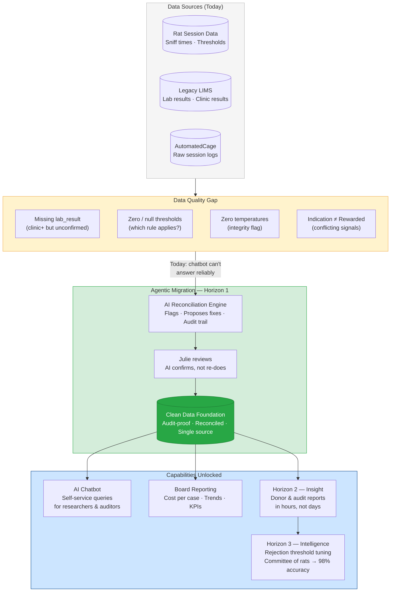
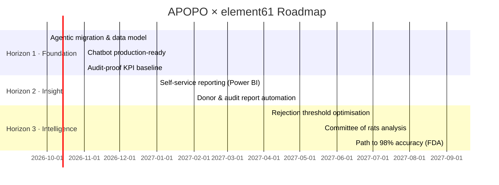

# POC Presentation Plan — APOPO × element61
**Audience:** Pieter (Head of Training & Research) + likely CEO  
**Format:** Board-ready, 5–7 slides. Situation → Complication → Resolution → Ask  
**Constraint:** Must stand alone — Pieter presents this to the board without element61 in the room

---

## Solution Blueprint

---

## The One-Sentence Pitch

> APOPO is 3% away from FDA approval. The answer is already in their data — but the data isn't clean enough to use it. element61 can fix that, and prove it saves money.

---

## Slide Structure

### Slide 1 — Situation
**"APOPO saves lives at scale — but is 3% short of its next milestone."**
- 95% accuracy today. FDA requires 98%. The gap costs patients and donor credibility.
- APOPO has years of historical rat + lab data that has never been systematically analysed.
- The data is there. The infrastructure to use it isn't.

### Slide 2 — Complication
**"The data quality problem is costing APOPO every day — in money and in missed cases."**
- From the actual data (`T1_NewLIMS_Export.csv`): show concrete DQ issues
  - Missing lab results (clinic_result populated, lab_result empty)
  - Zero temperatures recorded during sessions (data integrity flag)
  - Missing or zero indication thresholds (which threshold applies?)
  - Conflicting rat indications vs. rewarded outcomes
- Quantify: X% of records have at least one quality issue → translates to Y sessions where accuracy cannot be reliably calculated
- Headline: **"Every day without clean data, APOPO cannot know if its 95% claim is accurate"**

### Slide 3 — Insight (the chatbot demo goes here)
**"We asked your data a question. It couldn't answer — and showed us why."**
- Live demo: use the AI chatbot to ask business questions the board actually cares about:
  - *"Which rats have the highest false-negative rate this year?"*
  - *"What is the cost per confirmed TB case detected by rats vs. lab alone?"*
  - *"Which sessions should be flagged for quality review?"*
- Show that the chatbot surfaces data gaps in real-time — it doesn't make things up, it tells you what it can't answer and why.
- Flip it: show one question it *can* answer cleanly, and what that answer means for the business.
- Parci's framing: not a shiny demo — a mirror showing APOPO what clean data would unlock.

### Slide 4 — Resolution
**"Clean data + agentic migration = 20% fewer errors by December, at a known cost."**
- Three migration options (T-shirt sizing):
  - **S — Lift & shift**: move data as-is, clean later. Fast. Fragile.
  - **M — Greenfield + reconcile**: build a clean model alongside, reconcile records. Slower. Trustworthy.
  - **L — Agentic migration**: AI cleans, reconciles, and validates records *during* migration. Faster than M, more reliable than S. **Recommended.**
- Agentic migration differentiator: the same AI that powers the chatbot also flags and proposes fixes for dirty records — analysts confirm, not re-do.
- KPI commitment: 100% records reconciled, identical KPIs before and after, zero study downtime.

### Slide 5a — Maturity Snapshot (Goal 4)
**"Here is where APOPO stands today — honestly."**

| Dimension | Today | What's missing |
|-----------|-------|----------------|
| **Data** | Multiple siloed sources (AutomatedCage, legacy LIMS, clinic exports). No single source of truth. Records not reconciled. | Unified, audit-proof data model |
| **Reporting** | Manual, ad-hoc. No self-service. Board and donor reports built by hand. | Automated, audience-specific reporting |
| **AI** | None in production. PoC chatbot built this week — shows what's possible and where data blocks it. | Reliable AI requiring clean foundation first |

Framing for the board: *"This is not a criticism — it's a baseline. Every organisation starts here. The question is what it costs to stay here vs. move forward."*

---

### Slide 5b — Roadmap (Goal 4)
**"Three horizons. One decision unlocks the next. You set the pace."**

| Horizon | Name | What the board gets | Timeline | CAPEX (est.) | OPEX / month |
|---------|------|---------------------|----------|--------------|--------------|
| **1** | **Foundation** | Trusted data. Chatbot answers reliably. KPIs the board can stand behind. | Oct – Dec 2026 | €15k – €25k | €500 – €1k |
| **2** | **Insight** | Self-service reporting for researchers, auditors, donors. Reports in hours, not days. | Jan – Jun 2027 | €20k – €35k | €1k – €2k |
| **3** | **Intelligence** | AI-driven accuracy improvement. Rejection threshold tuning. Committee of rats. Path to FDA 98%. | Jul 2027 – Mar 2028 | €30k – €50k | €2k – €3.5k |

**Visible assumptions (state these explicitly):**
- Horizon 1 CAPEX assumes source system access is available within 2 weeks of sign-off and source system is not vendor-locked *(open question — see clarifying questions #8)*
- OPEX is cloud compute + storage only; element61 support billed separately if ongoing
- Horizon 1 timeline assumes the December deadline is end of December; shifts if earlier
- Costs are ranges — lower bound assumes clean handover of data and clear requirements; upper bound covers ambiguity and rework
- Horizons 2 and 3 are indicative; scoped in detail after Horizon 1 delivers

**3-year total cost of ownership (indicative):**
- Low scenario: €65k CAPEX + €54k OPEX = **~€120k over 3 years**
- High scenario: €110k CAPEX + €126k OPEX = **~€235k over 3 years**
- Cost of *not* acting: every year without clean data = Julie's time on fire-fighting + unverifiable 95% claim + donor risk

### Slide 6 — The Ask
**"One decision today unlocks everything else."**
- Decision: approve Horizon 1 (Foundation) as a fixed-scope, fixed-price engagement.
- What APOPO commits: data access, Julie's time for questions, confirmation of approved tools.
- What element61 commits: clean data, working chatbot, reproducible KPIs — by December.
- Price: [T-shirt size from roadmap].
- Next step: sign-off → kick-off within 2 weeks.

---

## Demo Script (Chatbot)

The chatbot demo in Slide 3 should follow this flow — rehearse it:

1. Ask a question the board cares about: *"How many TB-positive patients did the rats catch that the clinic missed this year?"*
2. The chatbot runs the query, returns an answer **with a confidence flag** — and surfaces a data quality warning (e.g. "lab_result is missing for 23% of clinic-positive records — this number may be understated").
3. Pause. Let that land. That warning *is* the pitch.
4. Then ask: *"If we fix that 23%, what does the number become?"* — show the upper-bound estimate.
5. Translate to impact: extra TB cases detected → patients treated → cost per case.

---

## What to Prepare Before the Presentation

- [ ] Run data quality analysis on `T1_NewLIMS_Export.csv` — compute exact % of records with DQ issues (missing lab_result, zero temp, zero threshold, mismatched indication/rewarded)
- [ ] Build 2–3 chatbot demo questions that hit the data quality gap cleanly
- [ ] Compute a rough "cost of dirty data" metric: sessions where accuracy is unverifiable × cost per session
- [ ] Prepare migration template comparison (S/M/L) with effort ranges in man-days
- [ ] Validate slide titles with Pieter before 16:00 on Day 1

---

## Anticipated Board Objections & Responses

| Objection | Response |
|-----------|----------|
| "We already have 95% accuracy — why invest now?" | Because you can't prove it from your current data. And the 3% gap to FDA costs more to close the longer you wait. |
| "This sounds expensive." | Horizon 1 is €15k–€25k, runs at €500–€1k/month. The cost of one missed TB case — clinically and reputationally — is orders of magnitude higher. |
| "Can't we just fix the data ourselves?" | Julie knows the data; she shouldn't spend her time on ETL. Agentic migration does it faster, with an audit trail, and frees her for research. |
| "What if the migration breaks something?" | That's the point of the PoC: we've already run your data and shown what breaks. Horizon 1 fixes it with zero study downtime as a KPI. |
