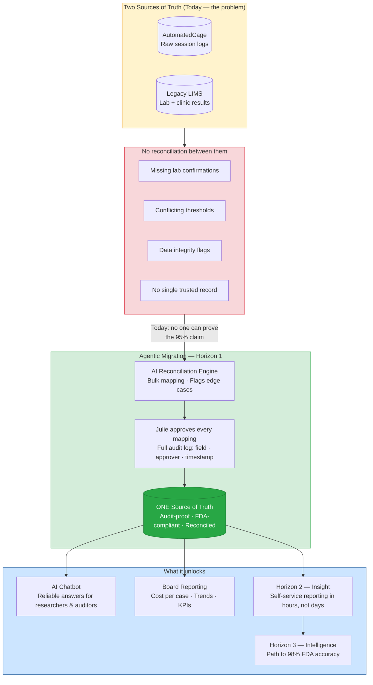
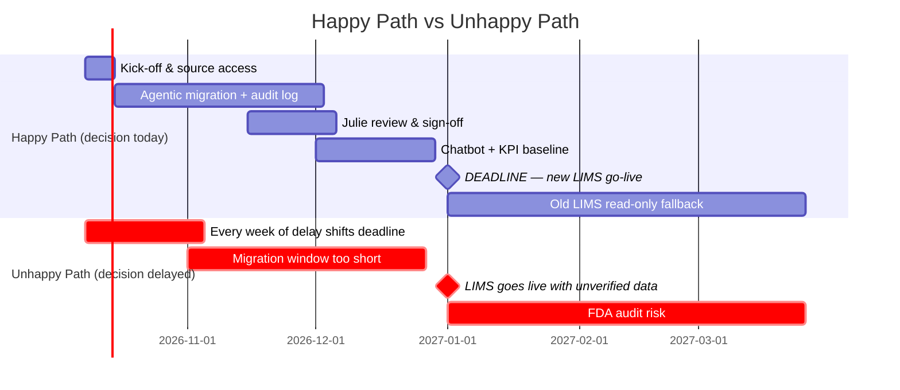

# POC Presentation Plan — APOPO × element61
**Audience:** Pieter (Head of Training & Research) + likely CEO
**Format:** Board-ready, 5–7 slides. Situation → Complication → Resolution → Ask
**Constraint:** Must stand alone — Pieter presents to the board without element61 in the room
**Action item:** Book follow-up meeting with Julie before presentation

---

## The One-Sentence Pitch

> APOPO is 3% away from FDA approval and has a hard deadline of 1 January 2027. The answer is in their data — but today there are two systems, neither trusted, and no reconciled source of truth. If the board doesn't decide today, the migration cannot happen in time.

---

## Solution Blueprint

---

## Slide Structure

### Slide 1 — Situation
**"APOPO saves lives — but is 3% short of FDA approval and the clock is running."**
- Rats screen TB samples every working day. 95% accuracy today. FDA requires 98%.
- The gap can be closed — the historical data is there. But it has never been systematically used.
- The board has a concrete decision to make today. Not next month. Today.

---

### Slide 2 — Complication
**"Two systems. Neither trusted. No single source of truth."**
- APOPO runs two separate data systems that have never been reconciled:
  - **AutomatedCage** — raw rat session logs (sniff times, indication, threshold)
  - **Legacy LIMS** — lab and clinic results
- They don't agree. Nobody has checked row by row. The vendor's own test migration was accepted — but not verified.
- Concrete evidence from the data:
  - Missing lab confirmations on clinic-positive samples
  - Zero or missing indication thresholds
  - Conflicting rat indications vs. rewarded outcomes
- **Headline: APOPO cannot today prove its 95% claim to the FDA — because the data that would prove it isn't reconciled.**

---

### Slide 3 — Insight (chatbot demo)
**"We asked your data a question. It couldn't answer — and showed us exactly why."**
- Live demo: ask the chatbot a question the board cares about:
  - *"How many TB-positive patients did the rats catch that the clinic missed?"*
- Chatbot surfaces a data quality warning in real time: *"lab_result is missing for X% of clinic-positive records — this number may be understated."*
- **Pause. That warning is the pitch.**
- Then flip it: show what the answer becomes once data is clean — the upper-bound impact.
- Translate to patients detected, cost per case saved.

---

### Slide 4 — Resolution
**"Three options. One fits the deadline. All three are on the table."**

Present the trade-off — Julie asked for this explicitly:

| Option | Approach | Weeks to Jan 1 | Study risk | FDA audit-proof | Cost |
|--------|----------|----------------|------------|-----------------|------|
| **S — Lift & shift** | Copy as-is, clean later | 4–6 w ✓ | Low | No — dirty data moves with you | X days |
| **M — Greenfield** | Redesign + manual reconciliation | 16–20 w ✗ | High (misses deadline) | Yes | X days |
| **L — Agentic** | Redesign + AI bulk mapping, Julie approves every mapping, full audit log | 10–12 w ✓ | Medium | **Yes** | X days |

**Recommendation: Option L**
- Only option that hits January 1 *and* gives APOPO an FDA-defensible audit trail
- Every field mapping: reviewed by Julie, logged (field · approver · timestamp) before it goes live
- Original raw exports archived unchanged — always retrievable, independent of LIMS
- Same AI powers the chatbot: one investment, two outputs
- Rats keep screening every day — zero study downtime

---

### Slide 5 — Roadmap
**"Two paths forward. You choose. But the choice has to be today."**

**Happy path:** Decision today → kick-off this week → migration done by mid-December → KPIs validated → new LIMS goes live clean on 1 January.

**Unhappy path:** Every week of delay compresses the migration window. At 4 weeks delay, Option L is no longer feasible. APOPO either goes live with unverified data (FDA risk) or misses the go-live date (study risk).

---

### Slide 6 — Maturity & Cost
**"Where you stand today. What it costs to move. What it costs to stay."**

| Dimension | Today | After Horizon 1 |
|-----------|-------|-----------------|
| **Data** | Two unreconciled systems, no single source of truth | One audit-proof source of truth, FDA-defensible |
| **Reporting** | Manual, ad-hoc, built by hand | Automated KPI baseline; chatbot for self-service |
| **AI** | None in production | Working chatbot on clean data |

**Cost framing** *(ranges — final scoping after source system confirmed)*:

| Horizon | What it delivers | One-off (CAPEX) | Monthly (OPEX) |
|---------|-----------------|-----------------|----------------|
| 1 — Foundation | Clean data + chatbot + audit trail by Jan 1 | X days | €500–€1k |
| 2 — Insight | Self-service reporting for researchers, donors, auditors | X days | €1k–€2k |
| 3 — Intelligence | Accuracy improvement → path to 98% FDA | X days | €2k–€3.5k |

**Cost of staying still:** Julie's time on manual fire-fighting + unverifiable 95% claim + FDA exposure + donor trust at risk. Every month without clean data is a month of compounding technical debt.

---

### Slide 7 — The Ask
**"One decision. Today. Everything else follows."**

> **If the board approves Horizon 1 today, element61 can kick off this week and hit the 1 January deadline. If not, the window closes.**

- **Decision:** approve Horizon 1 (agentic migration + chatbot + audit trail) as a fixed-scope engagement
- **What APOPO commits:** source system access this week, Julie's time for mapping approvals, confirmation of approved tools
- **What element61 commits:** one reconciled source of truth, working chatbot, FDA-defensible audit log — delivered by 1 January
- **Next step:** sign today → kick-off call tomorrow

---

## Demo Script (Chatbot — Slide 3)

1. Ask: *"How many TB-positive patients did the rats catch that the clinic missed this year?"*
2. Chatbot returns answer with confidence flag + data quality warning (e.g. missing lab results for X% of records)
3. **Stop. Let the warning land.** "This is what dirty data looks like in practice."
4. Ask: *"If we fix that, what's the upper bound?"* — show the range.
5. Translate: extra patients detected → lives → cost per case saved.

---

## What to Prepare Before the Presentation

- [ ] Run data quality analysis on `T1_NewLIMS_Export.csv` — exact % DQ issues per dimension
- [ ] Replace all "X days" with actual T-shirt estimates once source system is confirmed
- [ ] Build 2–3 chatbot demo questions that expose the data quality gap cleanly
- [ ] Book follow-up meeting with Julie
- [ ] Validate slide flow with Pieter before 15:00

---

## Anticipated Board Objections & Responses

| Objection | Response |
|-----------|----------|
| "We already have 95% — why act now?" | You can't prove it from current data. And the deadline is January 1. There is no later. |
| "This sounds expensive." | Horizon 1 runs at €500–€1k/month. The cost of missed FDA audit or a failed LIMS go-live is orders of magnitude higher. |
| "Can't we just do lift-and-shift?" | You can — but you take the dirty data with you. The FDA will see an unverified migration. Julie has already said that's not acceptable. |
| "What if we're not ready by January 1?" | Old LIMS stays read-only for 3 months max. That's the fallback. But original source exports are always archived — records are never lost. |
| "Can't Julie fix the data herself?" | Julie knows the data — she shouldn't spend December on ETL. The AI does the bulk; she approves the edge cases. That's the right use of her time. |
