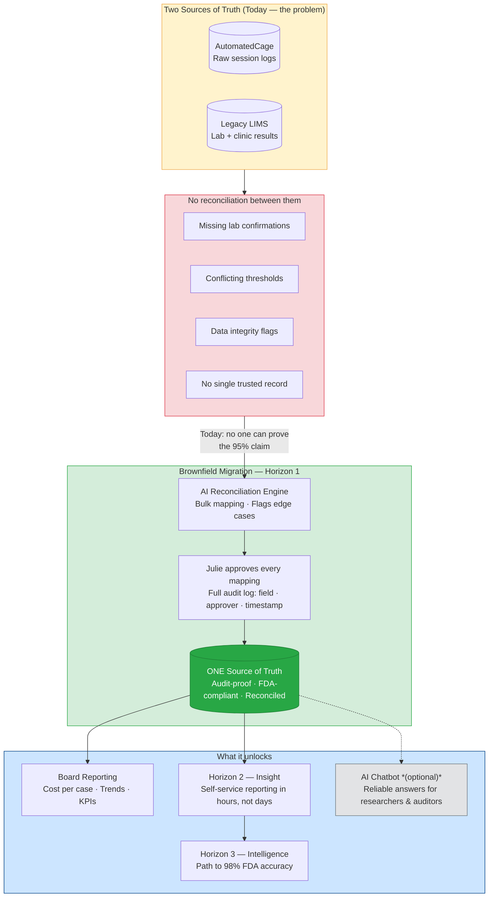
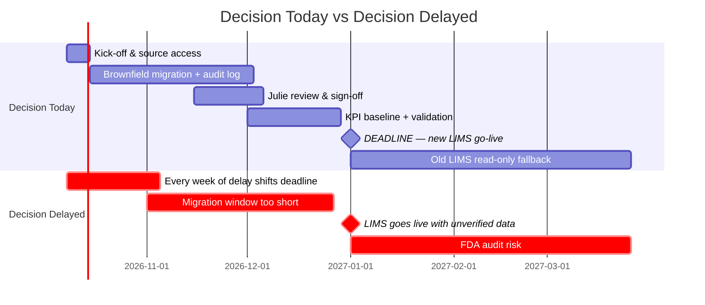

# POC Presentation Plan — APOPO × element61
**Audience:** Pieter (Head of Training & Research) + likely CEO
**Format:** Board-ready, 6 slides + optional demo appendix. Situation → Complication → Options → Ask
**Constraint:** Must stand alone — Pieter presents to the board without element61 in the room
**Action item:** Book follow-up meeting with Julie before presentation

---

## The One-Sentence Pitch

> APOPO is 3% away from FDA approval and has a hard deadline of 1 January 2027. The answer is in their data — but today there are two systems, neither trusted, and no reconciled source of truth. If the board doesn't decide today, the migration cannot happen in time.

---

## Assumptions

These assumptions underpin the entire presentation. If any of them are wrong, the recommendation changes. Validate with Pieter before presenting.

| # | Assumption | Risk if wrong |
|---|-----------|---------------|
| 1 | **1 January 2027 is a hard deadline.** The new LIMS go-live date is fixed and cannot be pushed. | If the deadline is flexible, the urgency argument weakens. Greenfield becomes a viable option. |
| 2 | **FDA requires 98% accuracy for approval.** This is the regulatory threshold APOPO is targeting. | If the requirement is different, the gap (and therefore the pitch) changes. |
| 3 | **APOPO currently achieves ~95% accuracy.** This is the claimed figure — not yet verifiable from reconciled data. | If the true figure is lower (or higher), the framing of the gap and the opportunity shifts. |
| 4 | **The data to close the gap exists in AutomatedCage and Legacy LIMS.** Reconciling these two systems will produce a dataset from which accuracy can be calculated and defended. | If key historical records are missing or corrupted beyond recovery, a brownfield approach cannot produce a defensible result. |
| 5 | **Full read access to both source systems can be granted in week 1.** AutomatedCage exports and Legacy LIMS data are accessible and shareable with element61. | Every week of delayed access compresses the review window. At 4 weeks of delay, brownfield is no longer feasible within the timeline. |
| 6 | **Julie is available during the review phase (weeks 3–8) and has authority to approve field mappings.** Her sign-off is what makes the audit log FDA-defensible. | If Julie is unavailable or her approvals are not considered authoritative, the audit trail loses its value. |
| 7 | **APOPO's IT/compliance team can confirm approved tooling before kick-off.** The AI reconciliation environment must meet APOPO's data residency and security requirements. | If approval takes weeks, the environment cannot be built in time. |
| 8 | **Cost estimates ("X days") will be confirmed after source system access.** All CAPEX figures are indicative until element61 can assess data volume and complexity firsthand. | Presenting specific numbers before seeing the data creates expectation risk. Keep ranges until scoping is complete. |
| 9 | **The old LIMS can remain in read-only mode for up to 3 months after go-live.** This is the safety fallback if something needs to be re-checked post-migration. | If the old LIMS must be decommissioned immediately on 1 January, the fallback disappears and risk increases. |

---

## Solution Blueprint

---

## Slide Structure

### Slide 1 — Situation
**"APOPO saves lives — but is 3% short of FDA approval and the clock is running."**
- Rats screen TB samples every working day. 95% accuracy today. FDA requires 98%.
- The gap can be closed — the historical data is there. But it has never been systematically used.
- There is a hard deadline: the new LIMS goes live 1 January 2027. That is the migration window. It is fixed.
- The board has a concrete decision to make today. Not next month. Today.

---

### Slide 2 — Complication
**"Two systems. Neither trusted. No single source of truth."**
- APOPO runs two separate data systems that have never been reconciled:
  - **AutomatedCage** — raw rat session logs (sniff times, indication, threshold)
  - **Legacy LIMS** — lab and clinic results
- They don't agree. Nobody has checked row by row. The vendor's own test migration was accepted — but not verified.
- Concrete evidence from the data:
  - Missing lab confirmations on clinic-positive samples
  - Zero or missing indication thresholds
  - Conflicting rat indications vs. rewarded outcomes
- **Headline: APOPO cannot today prove its 95% claim to the FDA — because the data that would prove it isn't reconciled.**

*This is not a hypothetical risk. This is what element61 found in the first pass of the data.*

---

### Slide 3 — Options & Why Brownfield
**"Three strategies. We considered all of them. Here is why we recommend one."**

All three strategies can include an AI/agentic component. The difference is the migration approach — and each has a real trade-off:

| Strategy | What it means | Pro | Con | FDA audit-proof | Weeks to Jan 1 |
|----------|--------------|-----|-----|-----------------|----------------|
| **Lift & shift** | Copy data as-is into new LIMS, reconcile later | Fastest. Lowest upfront effort. | Dirty data moves with you. The problem follows you into the new system. | No | 4–6 w ✓ |
| **Greenfield** | Redesign schema from scratch, repopulate manually | Cleanest possible result. Maximum control. | Misses the January deadline. Too slow for this window. | Yes | 16–20 w ✗ |
| **Brownfield** | Reshape and reconcile existing data into the new schema using AI | Hits the deadline *and* produces clean, defensible data. Julie approves every edge case — full audit log. | Requires Julie's time during migration. Requires source system access from day one. | **Yes** | 10–12 w ✓ |

**Why Brownfield:**
- Lift & shift is fast but kicks the problem down the road — APOPO would enter the new LIMS with the same data quality issues, just in a different system. The FDA risk doesn't disappear; it gets harder to fix post-migration.
- Greenfield is the right answer with unlimited time. APOPO does not have unlimited time.
- Brownfield is the only option that meets the January 1 deadline *and* gives APOPO a defensible, reconciled data set. The AI handles the bulk; Julie handles the judgment calls. Every decision is logged.

**What the AI specifically does in Brownfield:**
- Maps fields from AutomatedCage and Legacy LIMS to the new schema in bulk
- Flags records it cannot confidently map (conflicts, missing values, ambiguous thresholds)
- Generates a review queue for Julie — she approves, rejects, or overrides each flag
- Every action is written to an immutable audit log: field, decision, approver, timestamp
- Original source exports are archived unchanged — always retrievable, independent of LIMS

---

### Slide 4 — What We Need From APOPO
**"This only works if APOPO commits three things from day one."**

The Brownfield approach is not a black box. Element61 cannot reconcile data it cannot see, and Julie cannot approve mappings she is not available for. These are not optional:

| Commitment | Why it's critical | When needed |
|-----------|-------------------|-------------|
| **Full read access to both source systems** (AutomatedCage export + Legacy LIMS) | The AI cannot map what it cannot read. Access delays compress the migration window directly — every week of delay is a week less for Julie to review. | Week 1 (kick-off week) |
| **Julie's dedicated time for mapping review** | Julie is the domain expert. She is the only person who can validate ambiguous cases. The audit log is only FDA-defensible if approvals are real and timely. | Weeks 3–8 (review phase) |
| **Confirmation of approved tooling** (cloud environment, data residency constraints, AI vendor) | The AI reconciliation engine runs somewhere. APOPO's IT/compliance team needs to confirm what is permitted before element61 builds the environment. | Week 1 |

**If any of these slip, the timeline slips with them.** At 4 weeks of delay, Brownfield is no longer feasible and the choice becomes Lift & shift (with dirty data) or missing the go-live date.

---

### Slide 5 — Roadmap
**"Two paths forward. You choose. But the choice has to be today."**

**If the decision is made today:** Kick-off this week → migration done by mid-December → KPIs validated → new LIMS goes live clean on 1 January. Old LIMS stays read-only for 3 months as a safety fallback — original records are never lost.

**If the decision is delayed:** Every week of delay compresses the review window. At 4 weeks delay, Brownfield is no longer feasible. APOPO either goes live with unverified data (FDA risk) or misses the go-live date entirely (study risk).

---

### Slide 6 — Cost & The Ask
**"One decision. Today. Everything else follows."**

**Where APOPO stands:**

| Dimension | Today | After Horizon 1 |
|-----------|-------|-----------------|
| **Data** | Two unreconciled systems, no single source of truth | One audit-proof source of truth, FDA-defensible |
| **Reporting** | Manual, ad-hoc, built by hand | Automated KPI baseline |
| **FDA readiness** | Cannot prove 95% claim from current data | Full audit log, reconciled records, defensible |

**Cost framing** *(ranges — final scoping after source system access confirmed)*:

| Horizon | What it delivers | One-off (CAPEX) | Monthly (OPEX) |
|---------|-----------------|-----------------|----------------|
| 1 — Foundation | Reconciled data + audit trail by Jan 1 | X days | €500–€1k |
| 2 — Insight | Self-service reporting for researchers, donors, auditors | X days | €1k–€2k |
| 3 — Intelligence | Accuracy improvement → path to 98% FDA | X days | €2k–€3.5k |

**Cost of staying still:** Julie's time on manual fire-fighting + unverifiable 95% claim + FDA audit exposure + donor trust at risk. Every month without clean data is a month of compounding technical debt.

> **If the board approves Horizon 1 today, element61 can kick off this week and hit the 1 January deadline. If not, the window closes.**

- **Decision:** approve Horizon 1 (brownfield migration + audit trail) as a fixed-scope engagement
- **What APOPO commits:** source system access this week, Julie's time for mapping approvals, confirmation of approved tooling
- **What element61 commits:** one reconciled source of truth, FDA-defensible audit log — delivered by 1 January
- **Next step:** sign today → kick-off call tomorrow

---

## Appendix — Chatbot Demo (Optional, Slide 3 Enhancement)

*Use this if time allows and the audience wants a live proof-of-concept. It is not required to land the pitch — the data quality evidence on Slide 2 does that work.*

**Setup:** Ask a question the board cares about:
> *"How many TB-positive patients did the rats catch that the clinic missed this year?"*

1. Chatbot returns answer with confidence flag + data quality warning: *"lab_result is missing for X% of clinic-positive records — this number may be understated."*
2. **Stop. Let the warning land.** "This is what dirty data looks like in practice — even with a working AI on top of it."
3. Ask: *"If we fix that, what's the upper bound?"* — show the range.
4. Translate: extra patients detected → lives → cost per case saved.

**Point:** The chatbot surfaces the problem in real time. The warning is the pitch. Clean data doesn't just satisfy the FDA — it makes every answer APOPO gives more credible.

---

## What to Prepare Before the Presentation

- [ ] Run data quality analysis on `T1_NewLIMS_Export.csv` — exact % DQ issues per dimension (needed for Slide 2)
- [ ] Replace all "X days" with actual T-shirt estimates once source system is confirmed (Slide 6)
- [ ] Confirm tooling constraints with APOPO before presentation (Slide 4)
- [ ] Book follow-up meeting with Julie
- [ ] Validate slide flow with Pieter before 15:00
- [ ] Prepare chatbot demo questions as optional appendix material

---

## Anticipated Board Objections & Responses

| Objection | Response |
|-----------|----------|
| "We already have 95% — why act now?" | You can't prove it from current data. The FDA requires a defensible audit trail, not a claim. And the deadline is January 1 — there is no later. |
| "This sounds expensive." | Horizon 1 runs at €500–€1k/month. The cost of a failed FDA audit or a missed LIMS go-live is orders of magnitude higher — and Julie's time is not free either. |
| "Why not just lift-and-shift? It's faster." | It is faster — but the data quality problem doesn't disappear. It moves with you into the new system. You'd be starting the FDA approval process with the same unverifiable records, just in a different tool. Julie has flagged this as unacceptable. |
| "Why not greenfield?" | Greenfield would give you the cleanest possible result. But it takes 16–20 weeks. You have 12. Brownfield gives you most of the benefit at a fraction of the time. |
| "What if we're not ready by January 1?" | Old LIMS stays read-only for 3 months as a fallback. Original source exports are always archived — records are never lost. But the goal is to not need the fallback. |
| "Can't Julie fix the data herself?" | Julie knows the data better than anyone — that's exactly why she should be approving decisions, not doing ETL. The AI handles the bulk mapping; she handles the judgment calls. That's the right use of her expertise. |
| "What do you need from us?" | Three things: source system access in week one, Julie's time during the review phase, and confirmation of your approved tooling. Without those, the timeline cannot hold. |
